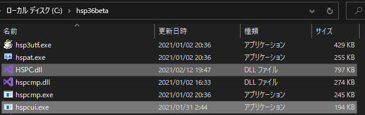

# HSPComanndLine
HSPのコマンドラインインターフェース。hspcのパクリ。
**HSP Dish のコンパイルはできません。従来通りHSPエディタからコンパイルしてください。**

# やること
[Release](https://github.com/Asugakoisi/HSPComanndLine/releases/tag/v0.2.1.0) をダウンロードして、中身をHSPシステムフォルダにコピーするか、  
以下の3ステップをやる。  
1. src\json\ja ディレクトリを丸ごとHSPシステムフォルダにコピーする。
2. src\json\en の中身を src\bin\en にコピーする
3. src\binディレクトリの中身を全てHSPシステムフォルダにコピーする。
  
つまり、こうなっていればいい。  
HSPディレクトリ:  
  
  
  
HSPディレクトリ\en:  
  
  
HSPディレクトリ\ja:  
  

ヘルプ機能も英語も表示しないって人は `ja`と`en`ディレクトリはいりません。  

# 注意
これを使うには、[HSP3.6β4](https://www.onionsoft.net/wp/archives/3274)以降が必要です。(strmap機能を使うため。)  

# 英語モード(--lang=en)について
ここで表示される英語は正しいものとは限りません。  
修正案があればIssuesで報告してください。  

# 使い方
こいつには残念ながら`-CPmD`とか`command`を理解できる能力はないので、一個づつ`-C -P -m -D`と入力してください。  
基本的に、hspc と hspcmp.exe のオプションに対応しております。  
コマンドの説明は `hspc --help --ls`を参照してください。  

# テンプレート機能  
これは開発でよく使うディレクトリ＆ファイルを簡単に複製できるようになるユーリティ機能です。  
hspc.exeがあるディレクトリ上に templates ディレクトリ が存在すれば、その中のディレクトリ達をテンプレート元として認識します。  
  
 `--tempo=` オプションについて  
このオプションは `--temp` `--temp=` `--tempa=`オプションの時に適応されます。  
`--temp` `--temp=`オプションでは、カレントディレクトリにコピーする際のディレクトリ名が変更され、 `--tempa=`オプションでは、テンプレートディレクトリにコピーする際のディレクトリ名が変更されます。  
例)  
`--temp=test --tempo=test_copy`の時   
- `template\test`の内容が `カレントディレクトリ\test_copy`にコピーされる。  

`--tempa=test --tempo=test_copy`の時  
- `カレントディレクトリ\test`の内容が `template\test_copy`にコピーされる。  

# プロファイル機能  
この機能は hspcui 独自の機能です。  
よく使うオプションをこの機能を使うことで省略することができます。  
プロファイルは、ユーザーファルダにある hspcuiconfig.json に登録できます。  
例）hspcuiconfig.json  
```JSON
{
  "$schema": "https://raw.githubusercontent.com/Asugakoisi/HSPComanndLine/main/src/json/hspcuiconfig-schema.json",
  "ver": "0.1.0.0-0.1.0.0",
  "profiles": [
    {
      "id": 0,
      "commands": [
        "-P",
        "-m",
        "-C",
        "-D"
      ]
    }
  ]
}
```
この時、  
```cmd
hspcui --profile=0 source.hsp
```
は  
```cmd
hspcui -P -m -C -D source.hsp
```
と同じになります。  


# AssemblyInfo.hsp 作成機能(プレリリース)
**この機能は予告なく変更される恐れがあります。**  
この機能は hspcui 独自の機能です。  
この機能により、`-o`,`--outname`オプションを使用して、作成する自動実行ファイル名を指定できるようになりました。  
また、ランタイム(`hsp3utf`、`hsp3_64`)を指定することができるようになりました。
そのために、`-a`,`-i` オプションでソースコードが`UTF-8`ときにはランタイムが自動的に`hsp3utf`になります。   
  
実際は適宜以下のマクロを`AssemblyInfo.hsp`に追加して、ソースファイルの一行目に`#include "AssemblyInfo.hsp"`を追加しているだけです。  
```HSP
#include "hsp3utf.as"
#include "hsp3_64.as"
#packopt name "ファイル名"
```  
もちろん、ソースコード側での指定が優先されます。  

# オプション一覧  
一文字オプション  
| オプション | 説明 |
| :----: | ---- |
| -a | ソースコードの文字コードを自動で判断します。 |
| -c | HSP ver2.6 としてコンパイルします。 |
| -C | カレントディレクトリをソースファイルが存在するディレクトリに変更します。 |
| -d | デバッグ情報を付与してコンパイルします。 |
| -D | コンパイル成果物の内、AssemblyInfo.hsp と自動実行ファイル以外を削除します。 |
| -E | hspcui 内で発生したエラーを無視して実行を続けます。 |
| -h??? | 指定したHSP命令を検索します。 |
| -i | ソースファイルが utf-8 であることを示します。 |
| -j | ソースファイルが shift_jis であることを示します。 |
| -m | 自動実行ファイルを作成します。 |
| -o??? | 出力するオブジェクトファイル(.ax)か strmap の名前を指定します。 |
| -p | プリプロセスのみを行います。 |
| -P | packfile を指定されたソースコードから作成します。<br>-D オプションを使用することで削除できます。 |
| -r | 指定されたソースファイルの実行をし、終了コードを出力します。<br>また、-mオプション指定時にはコンパイルした自動実行ファイルを実行します。 |
| -r= | 指定されたソースファイルを指定された引数を与えて実行し、終了コードを出力します。<br>また、コンパイル時にはその成果物を実行します。 |
| -s | 指定されたソースファイルから strmap を作成します。 |
| -u | 文字列データをUTF-8形式で出力します。 |
| -w | デバッグウインドウ表示フラグを設定します。 |

複数文字オプション  
| オプション | 説明　|
| :-----: | ---- |
| --compath= | common フォルダを指定します。 |
| --lang= | 実行時の言語を指定します。指定できる言語は ja か en です。| 
| --license | hspcui のライセンスを表示します。 |
| --online | -h オプションの検索時にオンラインで検索します。 |
| --outname= | 出力するオブジェクトファイル(.ax)か strmap の名前を指定します。 |
| --platform= | プラットフォームを指定します。指定できるのは x86 か x64 の二つです。|
| --profile= | 指定したプロファイルを実行します。 |
| --rtmpath= | runtime フォルダを指定します。 |
| --syspath= | HSPシステムフォルダを指定します。 |
| --temp | templates\default ディレクトリをカレントディレクトリにコピーします。 |
| --temp= | 指定されたテンプレートディレクトリをカレントディレクトリにコピーします。 |
| --tempd | templates\\default ディレクトリを削除します。 |
| --tempd= | 指定されたテンプレートディレクトリを削除します。 |
| --tempa= | 指定したディレクトリを templates ディレクトリにコピーします。 |
| --tempo= | コピー先でのディレクトリ名を指定します。 |
| --version | hspcui のバージョンを表示します。 |


# 履歴
01/16 Version 0.2.1.0 公開
- `--profile=`オプションで`--platform=x64`を指定して、そのあと`--platform=x86`を指定しても変更されない  
- `AssemblyInfo.hsp` が作成されないことがある  

01/16 Version 0.2.0.0 公開  
- `--platform=` オプションの追加  
- `AssemblyInfo.hsp`を作成する機能の追加  
- 上記の機能の追加による `-o`,`--outname=`,`-a`,`-i` オプションの動作変更  
- `--help --ls` オプションで表示される情報を減らしました  

01/11 Version 0.1.1.0 公開  
- `--version`、`--license` オプションの追加  
- `--version`、`--license` オプションのヘルプ追加  

01/10 Version 0.1.0.0 公開  

# こっちもみてね
[hspc の公開ページ](http://dev.onionsoft.net/seed/info.ax?id=1392)  
[HSP 公式サイト](http://hsp.tv/index2.html)
