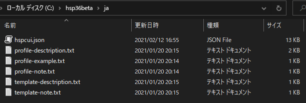

# HSPComanndLine
HSPのコマンドラインインターフェース。hspcのパクリ。

# やること
1. src\json\ja ディレクトリを丸ごとHSPシステムフォルダにコピーする。
2. src\json\en の中身を src\bin\en にコピーする
3. src\binディレクトリの中身を全てHSPシステムフォルダにコピーする。
  
つまり、こうなっていればいい。  
HSPディレクトリ:  
  
  
  
HSPディレクトリ\en:  
  
  
HSPディレクトリ\ja:  
  

# 注意
これを使うには、[HSP3.6β4](https://www.onionsoft.net/wp/archives/3274)以降が必要です。(strmap機能を使うため。)  

# 英語モード(--lang=en)について
ここで表示される英語は正しいものとは限りません。  
修正案があればIssuesで報告してください。  

# 使い方
こいつには残念ながら`-CPmD`とか`command`を理解できる能力はないので、一個づつ`-C -P -m -D`と入力してください。  
基本的に、hspc と hspcmp.exe のオプションに対応しております。  
コマンドの説明は `hspc --help --ls`を参照してください。  

# こっちもみてね
[hspc の公開ページ](http://dev.onionsoft.net/seed/info.ax?id=1392)  
[HSP 公式サイト](http://hsp.tv/index2.html)
